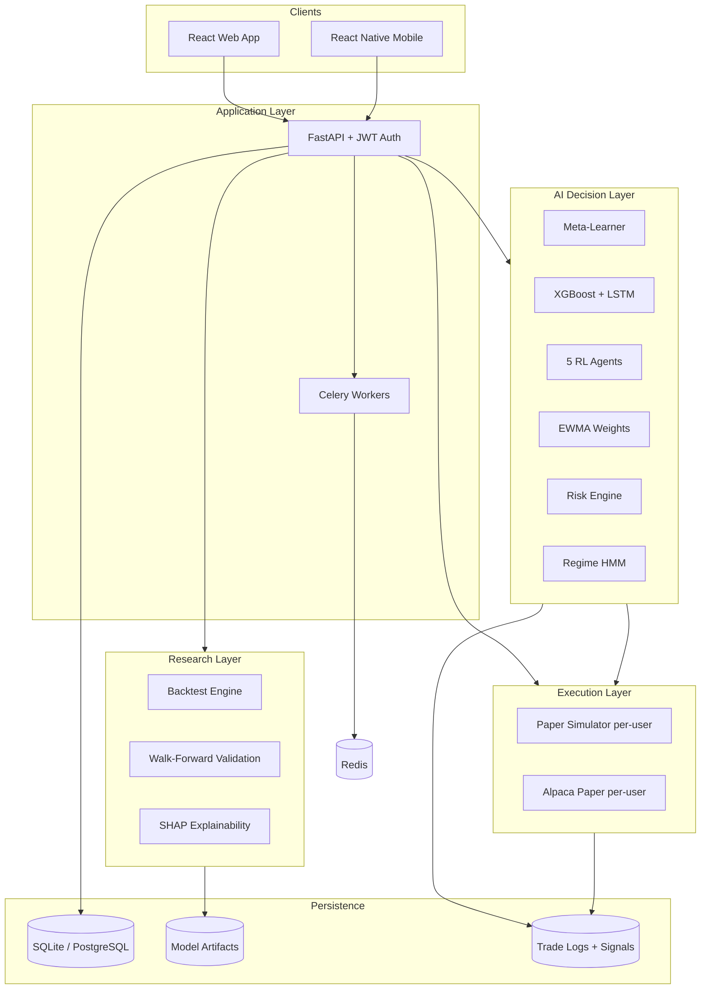
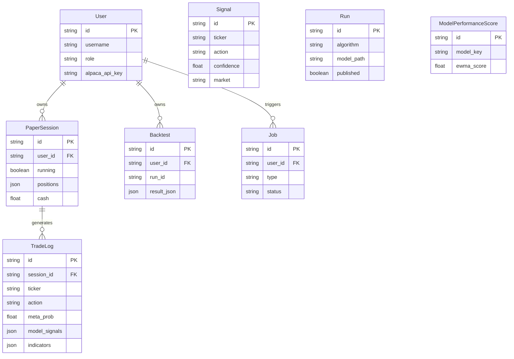
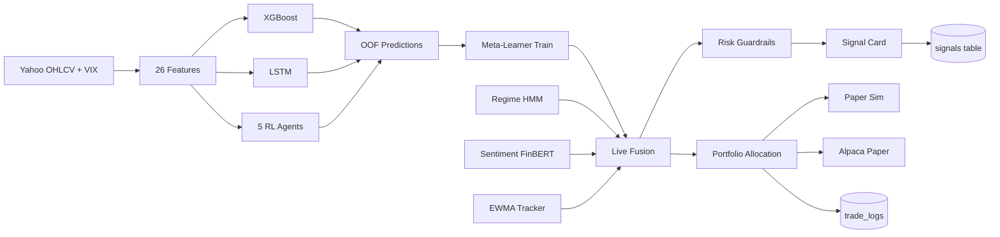
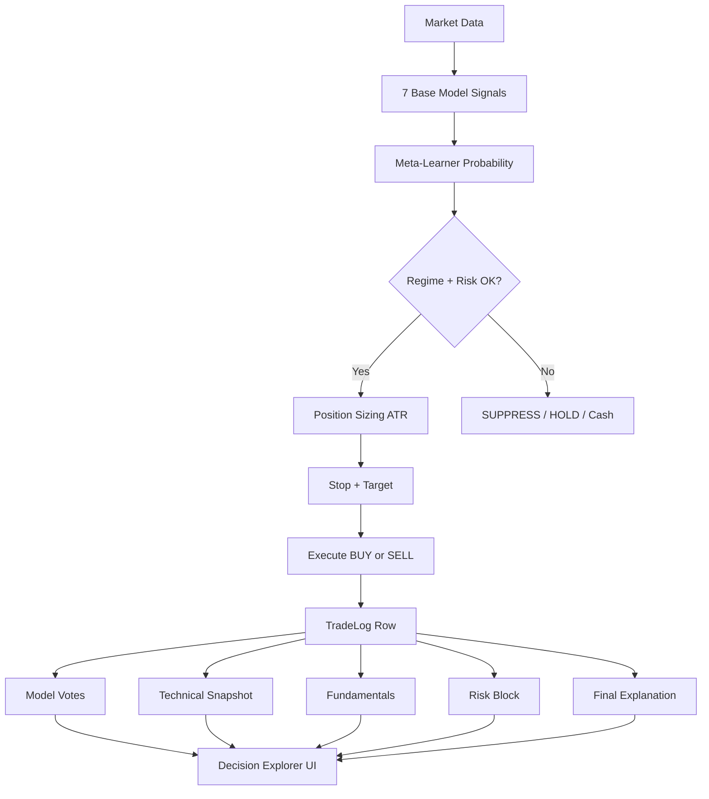
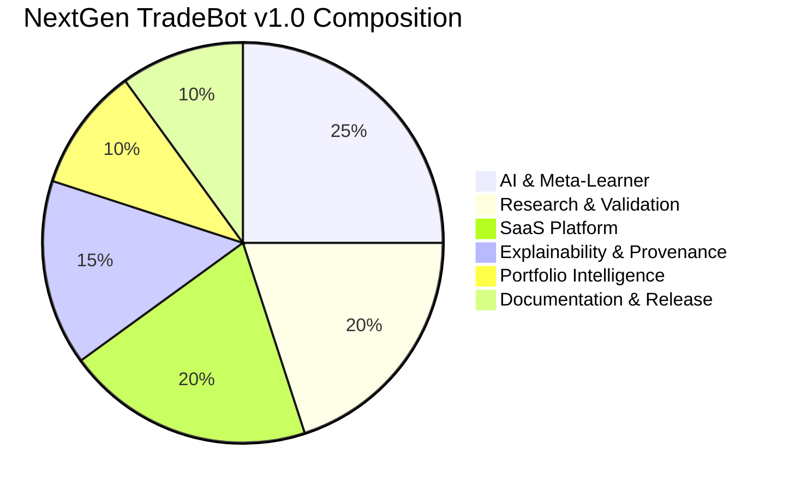
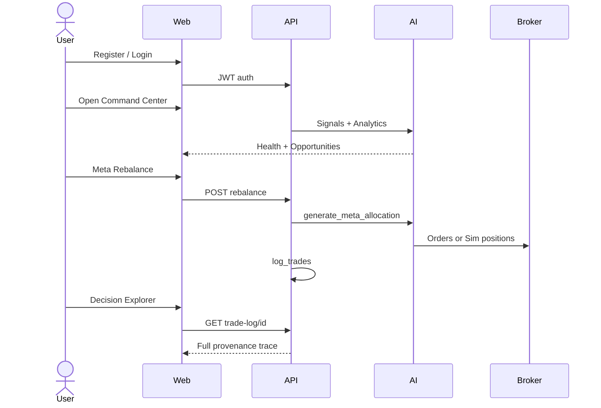

# NextGen TradeBot — Defense Diagrams

Mermaid diagrams for thesis slides and examiner handouts. Render in GitHub, VS Code, or [mermaid.live](https://mermaid.live).

---

## 1. System architecture

---

## 2. Entity-relationship (core tables)

**Tenancy:** `Signal`, `Run`, `ModelPerformanceScore` are **shared**. `PaperSession`, `Backtest`, `Job`, `TradeLog` are **per-user**.

---

## 3. AI pipeline (live signals)

---

## 4. Decision provenance chain

---

## 5. Product effort distribution (v1.0)

---

## 6. User journey (defense demo)

